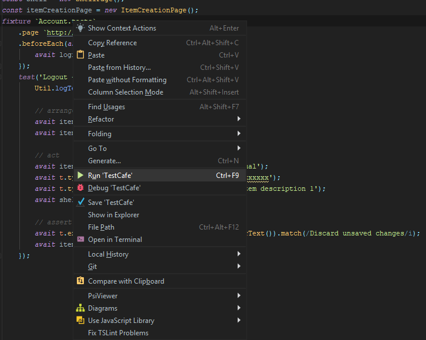
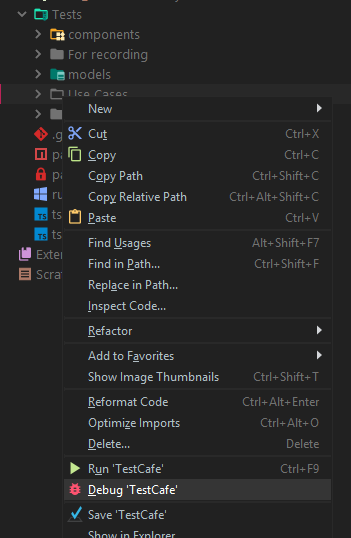
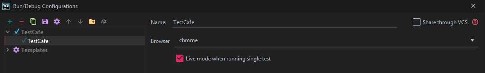

# TestCafe runner for Webstorm

Integration with [TestCafe](https://devexpress.github.io/testcafe/) TestCafe A node.js tool to automate end-to-end web testing. 
This plugin allows you to run TestCafe tests directly from Webstorm.

* Run a particular test, fixture, all tests in a file or directory via the context menu
* View test results in the 'Run Console'

## Requirements

TestCafe should be installed in your project as a local package. To install it, use the npm install testcafe command or add TestCafe to dependencies in your package.json file. Your project should contain TestCafe modules in node_modules\testcafe\.... 

### Running a specific test

To run a specific test, invoke the context menu when the cursor is placed on the test name.

### Running all tests in a fixture

To run all tests in a test fixture, invoke the context menu when the cursor is placed on the fixture name.

### Running all tests in a file

To run all tests in the current file, invoke the context menu for this file.

### Running all tests in a folder

To run all test files in a folder, invoke the context menu for this folder.

### Change browser

You can change the browser in the run configuration.

