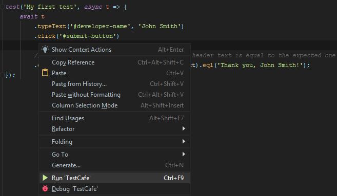
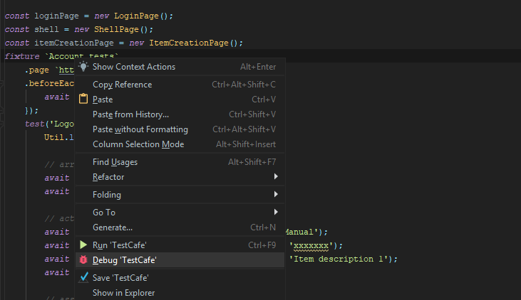
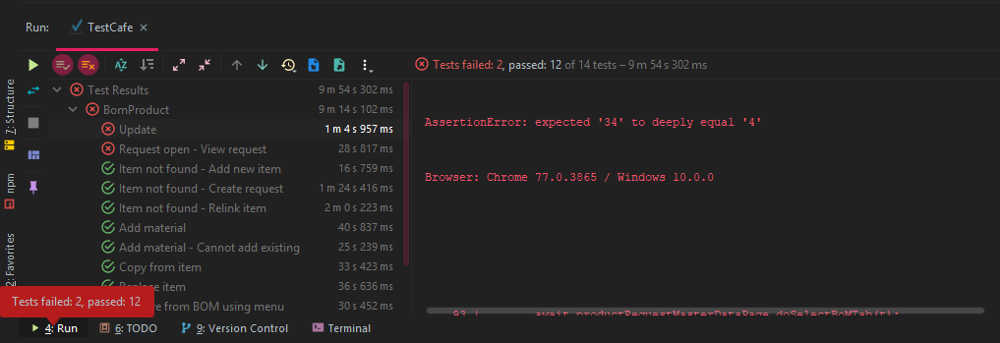

# TestCafe runner for Webstorm

Integration with [TestCafe](https://devexpress.github.io/testcafe/) A node.js tool to automate end-to-end web testing. 
This plugin allows you to run TestCafe tests directly from Webstorm.

* Run a specific test, fixture, all tests in a file or directory via the context menu
* Debug a specific test, fixture, all tests in a file or directory via the context menu
* Run a single test in live mode for easier test creation: https://devexpress.github.io/testcafe/documentation/using-testcafe/common-concepts/live-mode.html
* View test results in the run window

## Requirements

TestCafe should be installed in your project as a local package. To install it, use the npm install testcafe command or add TestCafe to dependencies in your package.json file. Your project should contain TestCafe modules in node_modules\testcafe\.... 

### Configuration

You can change the browser/enable live mode in the run configuration.

### Running/debugging a specific test

To run/debug a specific test, invoke the context menu when the cursor is placed inside the test body.

### Running/debugging all tests in a fixture

To run/debug all tests in a test fixture, invoke the context menu when the cursor is placed on the fixture name.

### Running/debugging all tests in a file

To run/debug all tests in the current file, invoke the context menu for the file outside of a test body.

### Running all tests in a folder

To run all test files in a folder, invoke the context menu for this folder.

### Tests results

The test results are shown in the run window.

